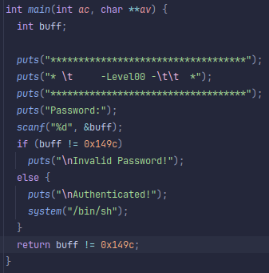

## Level 00
## Source Code:

## Walkthrough
- We will R.E the binary inside Ghidra.
- We found that the binary ask the user for an int through scanf.
- And then the program check that the input is equal to 0x149C (5276).
## Answer
    ./level00
    Password: 5276
## Flag
uSq2ehEGT6c9S24zbshexZQBXUGrncxn5sD5QfGL