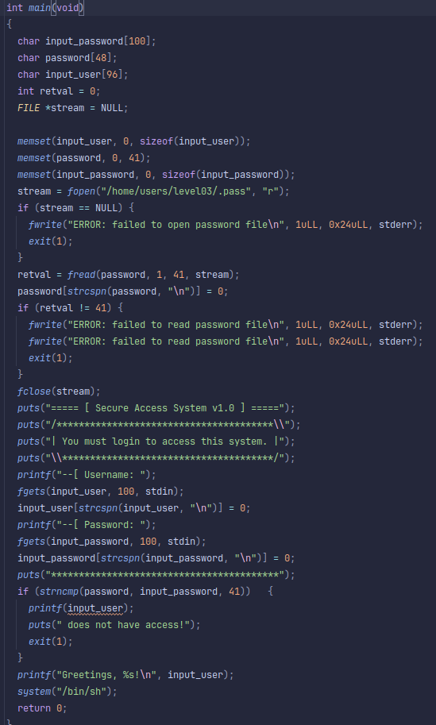

## Level02
## Source Code

## Walkthrough
- We reverse the binary to find the logic of this program.
- The binary is owned by user `level03` and the set-uid bit is set.
- The printf after the `strncmp` is vulnerable because we control the format string.
- 
## Flag