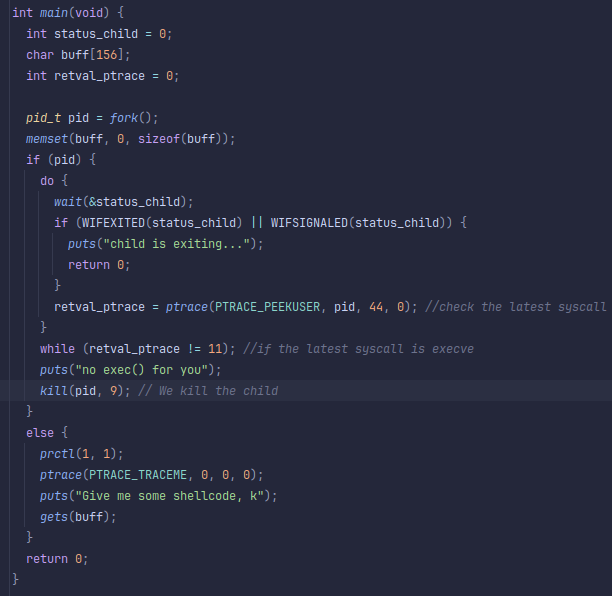

## Level04
## Source Code

## Walkthrough
- We reverse the binary through ghidra.
- The binary fork itself and wait for the child to exit.
- The parent will check if the child isn't calling `execve` and will kill the process if it does.
- The child ask of a shellcode with a `gets`, we can overflow a buffer here cause gets isn't protected.
- We will use the same `craft_payload.py` as level01 with a different buffer size.
## Answers
    cat /tmp/payload - | ./level04
    cat /home/users/level05/.pass
## Flag
    3v8QLcN5SAhPaZZfEasfmXdwyR59ktDEMAwHF3aN