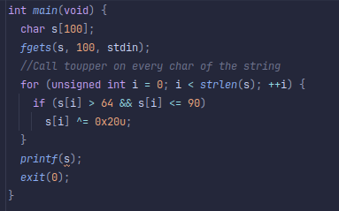

## Level 05
## Source Code

## Walkthrough
- We reverse the binary through ghidra.
- There is a vulnerable `printf` after a `touper` on all char of the string.
- We generate a shell that will just call `system("/bin/sh")` and export it in the env.
- In a payload, we use a combination of `%yx` to print y spaces and `%x$n` to write the number of char print on the x offset.
## Answer
    export SHELLCODE=$(python generate_shellcode.py)
    cat /tmp/payload - | ./level05
    cat /home/users/level06/.pass
## Flag
    h4GtNnaMs2kZFN92ymTr2DcJHAzMfzLW25Ep59mq