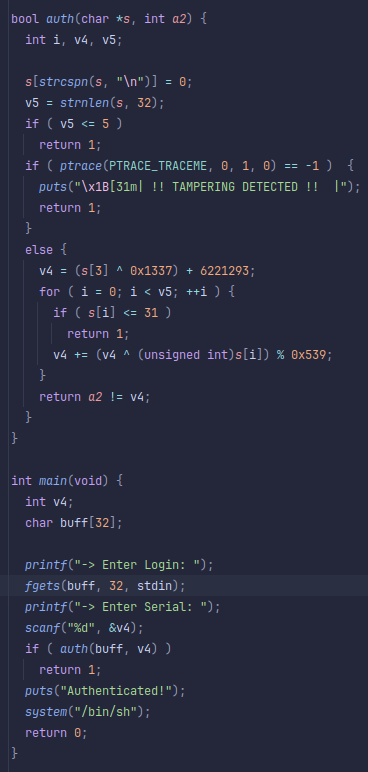

## Level06
## Source Code

## Walkthrough
- We reverse the binary through ghidra.
- We need to find the serial to access the call to `system("/bin/sh")`
- We can use the algorithm found in the binary to "bruteforce" the password.
## Answer
    ./get_auth
    "result = 6231562"
    ./level06
    login: aaaaaa   
    serial: 6231562
    cat /home/users/level07/.pass
## Flag
    GbcPDRgsFK77LNnnuh7QyFYA2942Gp8yKj9KrWD8