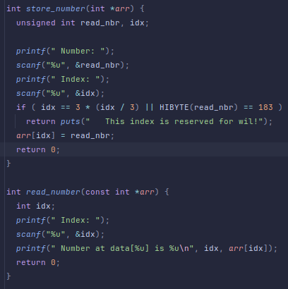
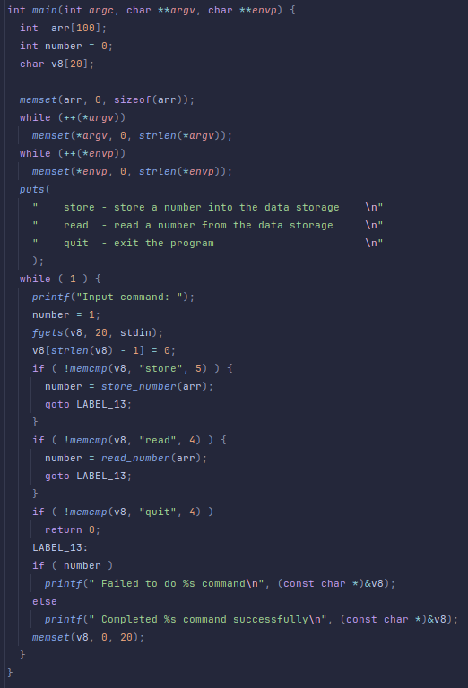

## Level07
## Source code

## Walkthrough
	address of array begin 0xffffd544
	0xffffd51c => return address
	0xffffd524 => location for "/bin/sh"

	location of system = 0xf7e6aed0 => 4159090384
	location 0f "/bin/sh" = 0xf7f897ec => 4160264172
## Answer

## Flag
