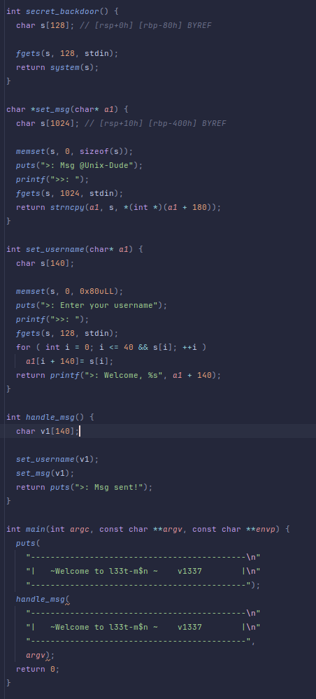

## Level09
## Source Code

## Walkthrough
- We want to execute the function secret_backdoor
- There is a vulnerable strncpy wich writes a number of char that is on the stack
- We can modify this value through the set_username function which writes 41 char instead of 40 (first part of the payload)
- Without any input, the secret_backdoor function will use what is on the stack at the correct offset as argument for system, that is found in the second part of the payload
- We can now return to the secret_backdoor function by writing the address of the function at the correct offset in the last part of the payload
## Answer
    python craft_payload.py
    ./level09 < /tmp/payload

## Flag
    j4AunAPDXaJxxWjYEUxpanmvSgRDV3tpA5BEaBuE